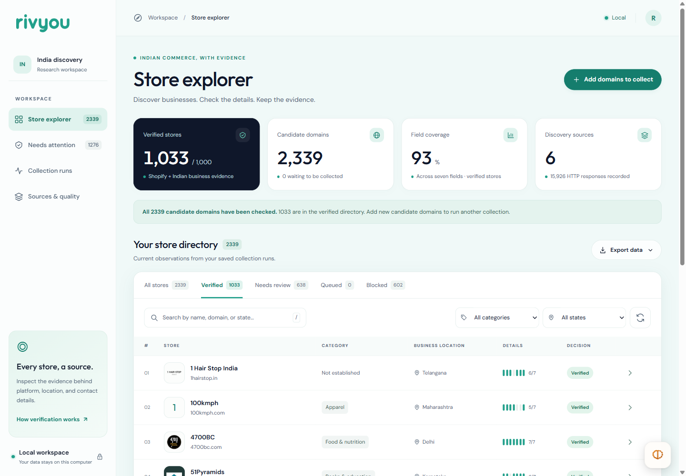

# Rivyou — Indian Shopify store discovery

A local pipeline and a browser workbench for finding Indian Shopify stores. The result file is **[outputs/stores.csv](outputs/stores.csv)**, with the same records in **[JSON](outputs/stores.json)**. Every accepted store has saved evidence for both Shopify and an Indian business address.

<!-- RESULT_START -->
**1,033 automatically verified stores from 2,339 candidate domains, after deduplication.** Snapshot `96232f7c659ca586`, generated 2026-09-30T14:02:04.213712+00:00. Both required checks passed for every exported store. The result has not had an independent human audit.
<!-- RESULT_END -->



## Open the app

Requires Python 3.12. Run from this folder in PowerShell:

```powershell
.\start.ps1
```

Open **http://127.0.0.1:8765**. No Supabase project, AI API key, or paid discovery service is required. The interface uses SQLite on this computer. It follows Rivyou's teal/mint palette and typography; the tokens are in [docs/DESIGN_SYSTEM.md](docs/DESIGN_SYSTEM.md).

Manual setup:

```powershell
py -3.12 -m venv .venv
.\.venv\Scripts\python.exe -m pip install -r requirements.lock
.\.venv\Scripts\python.exe -m pip install -e . --no-deps
.\.venv\Scripts\python.exe -m rivyou.cli serve
```

The app lets you import domains, collect pages, pause and resume runs, search/filter stores, inspect evidence, record review notes, and download results. A finished queue means the known domains have been processed. Import another source to continue; it does not mean the existing result was lost.

## What to submit

| File | What it contains |
| --- | --- |
| [stores.csv](outputs/stores.csv) / [stores.json](outputs/stores.json) | One row per accepted store, with all seven requested data groups |
| [evidence.jsonl](outputs/evidence.jsonl) | Extracted values, merchant page URLs, excerpts, observation dates, hashes, and rules |
| [run-report.json](outputs/run-report.json) | Counts, missing-field rates, source yield, run configurations and timings |
| [source-manifest.json](outputs/source-manifest.json) | Candidate domains and their discovery attribution, including unresolved candidates |
| [unresolved.json](outputs/unresolved.json) | Records left outside the result and the reason |
| [audit-sample.json](outputs/audit-sample.json) | Reproducible sample for an independent reviewer; blank review fields are intentional |
| [manifest.json](outputs/manifest.json) | Snapshot ID, row count, and checksums of the exact exported bytes |

The app's **Export data → Complete snapshot** downloads these files as a ZIP. CSV and JSON are produced from the same projection as the store explorer.

The assignment's contacts group is split into `emails` and `phones`, so its seven groups occupy eight data columns. Contacts are arrays; `socials` maps networks to arrays of profile URLs. CSV stores those arrays as JSON inside a cell. Missing text is null in JSON and empty in CSV. CSV escapes spreadsheet-formula prefixes; JSON keeps the original value. `store_id` and `observed_at` are extra traceability columns.

## Reproduce the collection

After installing the package, these commands fetch a public lead list and work through it in bounded batches:

```powershell
.\.venv\Scripts\python.exe -m rivyou.cli discover-source dukaan --limit 500
.\.venv\Scripts\python.exe -u scripts\build_dataset.py --target 1000 --max-leads 3500 --start-offset 500 --cached
.\.venv\Scripts\python.exe -m rivyou.cli reprocess --limit 10000 --offline --processes 3
.\.venv\Scripts\python.exe -m rivyou.cli export
.\.venv\Scripts\python.exe scripts\validate_snapshot.py outputs
```

`--cached` reads the previously downloaded source after verifying its hash. It preserves the source's original retrieval time. It does **not** skip live verification of merchant websites. Without this flag the adapter fetches the public source again, subject to robots rules.

The batch driver collects queued domains, gives unresolved records one bounded follow-up, writes a snapshot, then imports the next source slice. It stops at the target or lead budget. The target is a stopping condition, not a promise about yield. Exit code 2 means the target was not reached or a run was paused. The snapshot still contains only qualifying records. Re-importing a slice does not create duplicate candidates.

A fresh checkout starts with an empty live workspace; the submitted files in `outputs/` can be read immediately. To recheck the exact exported candidate set when a directory is unavailable:

```powershell
.\.venv\Scripts\python.exe -m rivyou.cli import outputs\source-manifest.json
.\.venv\Scripts\python.exe -u scripts\build_dataset.py --target 1000 --max-leads 0
```

This imports source attribution only. Prior acceptance labels are not trusted; the merchant checks run again. `--max-leads 0` disables new directory discovery and consumes the imported queue. Use a separate `RIVYOU_WORK_DIR` and `--output` directory if you want to compare a fresh run with this snapshot.

For smaller runs:

```powershell
.\.venv\Scripts\python.exe -m rivyou.cli import data\seeds\shopify-editorial.json
.\.venv\Scripts\python.exe -m rivyou.cli discover-source eachspy --limit 100
.\.venv\Scripts\python.exe -m rivyou.cli collect --limit 100 --max-mib 8 --workers 8
.\.venv\Scripts\python.exe -m rivyou.cli enrich --limit 100
.\.venv\Scripts\python.exe -m rivyou.cli status
```

An interrupted or paused collection/enrichment/full replay can be resumed with `collect --resume RUN_ID`; its original operation and configuration are restored. After computer suspension, confirm that the original runner has exited before resuming: the current two-minute heartbeat timeout can mark a still-live process as interrupted. Durable process leases are a remaining limitation. Browser pause requests also reach CLI workers through SQLite. `reprocess --offline` uses saved pages and cached logos, preserving their original observation dates. It makes no merchant requests. `--processes 3` uses three CPU processes for this offline step; omit it on a machine with little free memory.

## The approach

### 1. Use sources for leads

Three source routes supplied candidates:

- **Shopify editorial examples.** The first 26 development candidates came from Shopify's [Indian storefront article](https://www.shopify.com/in/blog/look-good-perform-better-19-websites-built-on-shopify-that-are-a-visual-delight) and its clothing, jewellery and store example articles. Exact attribution is in [data/seeds](data/seeds/).
- **TeamDukaan's public performance list.** Its [pinned CSV](https://github.com/TeamDukaan/performance/blob/b9be3b56f962538ba153ab196ba3ac5014561c56/shopify%20stores%20-%20shopify.csv) contained 9,762 unique normalized URL leads. It is historical and includes dead, foreign and non-Shopify sites. We use bounded slices and check every merchant again. No explicit repository licence was found. Only domain facts are used as leads; the original whole list and source code are not redistributed as our work.
- **EachSpy's public India directory.** Only domain names in the public [Store tables](https://www.eachspy.com/shopify/stores-in-india/) are imported. Its contacts, descriptions, logos and country labels are not copied into results. This provided a small second directory route, not thousands of records.

[data/discovery](data/discovery/) records the source URLs, retrieval dates, content hashes, offsets and import counts. Different sources can overlap, so their accepted counts must not be added together.

The initial plan proposed a Common Crawl Parquet experiment. After research, the smaller public list gave a practical source to measure without scanning a large index. Narrow CDX lookup and saved-CDX import are implemented, but Common Crawl did not supply this dataset. That change in plan is deliberate; there is no claim that an unused adapter found these stores.

### 2. Collect useful pages politely

For each normalized domain, the crawler checks robots.txt, fetches the homepage, and ranks same-site contact, about, privacy, terms, returns and shipping links. Product pages, collections and app links are excluded from this small information-page budget.

A normal pass attempts at most seven HTML pages, plus up to three logo candidates. Failed requests count against the budget. One enrichment pass for confirmed Shopify sites missing India proof, and for unreachable homepages, reuses saved HTML and can try four additional public information routes, still subject to robots rules. A homepage that previously exceeded the limit can be retried under the larger limit. Enrichment is not an endless retry loop.

Default settings are eight workers, one request at a time per host, a two-second minimum gap, a 20-second read timeout (eight seconds for connecting) and at most two transient retries. Robots crawl delays can increase the wait. Redirects stop after five hops. The response cap is now 8 MiB for the CLI and workbench. The initial pilot used 2 MiB; that proved too small for several genuine Shopify homepages. Run history contains the actual settings, including worker counts.

Unavailable robots rules defer collection. Robots 404/410 responses allow it. Long retry waits are deferred. There is no CAPTCHA bypass, proxy rotation, login or checkout interaction. Requests identify as `RivyouResearch/0.1`; an operator contact URL has not been invented.

Every response has an outcome, timestamp and content hash. Snapshots are compressed locally without changing the hash of their original bytes. The fetcher rejects private destinations, pins connections to validated public IPs, retains the hostname for TLS, and applies those checks again on redirects.

### 3. Verify Shopify and India separately

**Shopify requires three signal families:** a public `Shopify.shop` identity ending in `.myshopify.com`, a separate Shopify runtime/theme asset, and commerce markup such as product links or an add-to-cart form. A CDN image, a footer credit or a domain suffix is not enough. Conflicting identities/platform signals go to review. Some headless stores will be missed.

**India requires merchant-page business address evidence.** The parser looks for address context, an Indian state/city and address structure, usually with a six-digit PIN. A clearly labelled registered office with an explicit country, recognized location and street/premise can qualify without a PIN. Shipping to India, INR prices, `.in` and an Indian phone number cannot qualify alone. Supplier and returns-only logistics addresses are excluded.

“Based in India” means the merchant has a supported Indian business establishment. It does not mean Indian hosting or Indian ownership. An Indian `.com` business can qualify. A foreign brand merely shipping here cannot. A brand with an actual Indian business office can qualify under this definition even if its ownership is overseas. This is a website-evidence rule, not verification against a company registry.

Registered/principal offices take priority over corporate/head offices, then other business addresses. Equally ranked addresses in different states leave `state` empty while retaining the India evidence.

### 4. Extract the fields

| Field | Extraction rule |
| --- | --- |
| Domain | Customer-facing homepage after redirects; keep aliases and Shopify identity |
| Contacts | Public mailto/tel/WhatsApp links, visible text and same-site organization contact metadata; normalize and deduplicate; filter template and known platform/payment contacts |
| Socials | Site-linked Instagram, Facebook, X/Twitter, LinkedIn, YouTube and Pinterest profile URLs; discard sharing, intent and embed links |
| Category | Weighted keyword taxonomy in `src/rivyou/categories.py`, using merchant description/name and navigation; ties and weak matches stay empty |
| Description | Homepage meta description, falling back to Open Graph description; up to 700 characters kept verbatim, with truncation flagged in the evidence rule |
| Logo | Organization metadata or a header/home-link brand image; reject favicons and utility icons; validate the downloaded image |
| State | State/UT supported by the highest-ranked business address; ambiguity remains null |

“All contacts” means all qualifying public contacts found in the allowed pages collected by this run. It is not a claim to have found every number anywhere on a domain. WHOIS/RDAP, OCR, browser rendering and email deliverability checks are not implemented. Public email spelling is preserved. Social links are merchant claims, not independently authenticated accounts.

Each populated field keeps its source page and extraction rule. A monogram shown in the interface is only a placeholder and is never exported as a logo. SVG previews are sanitized before serving locally.

### 5. Deduplicate and review

URL spelling is normalized on import. Accepted stores are then grouped by primary URL and observed Shopify identity. Prefer a custom domain, preserve aliases, and merge discovered contacts/socials with their evidence. Different Shopify shops stay separate even when their brand names match. Private suffix handling prevents unrelated myshopify tenants from collapsing together.

Reviews are append-only notes tied to the evidence hash. A review cannot force acceptance when a required check is absent. Evidence older than seven days is left out of new verified exports; a saved result file retains its original dates.

## What changed after the pilot

The first broader pilot processed **288 new candidates in 519.5 seconds**: 124 raw accepts, 85 needing review, 51 robots-blocked and 28 unreachable within the configured limits. These are pre-deduplication, pre-enrichment decisions. The measured pilot report is in [data/discovery/pilot-report.json](data/discovery/pilot-report.json).

Several fixes came from reading the failures:

- Real homepages exceeded 2 MiB, so later batches use a bounded 8 MiB cap.
- Product names containing “about” wasted information-page requests. Product/collection/app routes are now excluded.
- Some merchants publish addresses only in Shopify policy routes. The bounded enrichment pass tries those routes.
- A registered office can be clear without a postal code. The rule now accepts a complete labelled street address while rejecting a city/country label plus a founding year.
- A toy store was classified from an incidental navigation word. Category selection now requires stronger evidence and covers more product groups.
- Windows newline conversion broke saved-file checksums. Exports now write exact UTF-8 bytes, and Git preserves those bytes.

Contact review also found template `yourstore.com` mailto links and malformed `&nbsp` text. Those are filtered/decoded, and same-site organization contact metadata recovers published numbers that text parsing can miss. Regression tests cover these cases. The final sample also exposed a copied mailto target, concatenated email/profile text, social posts, and a parent-company footer logo. Rule 8 filters these cases, requires JavaScript/CSS runtime evidence, and checks same-site home links for logos. Email validation uses the bundled public-suffix list, so a new suffix absent from that list may be missed. Development examples are not an independent accuracy sample.

After the full rule-7 replay, `rivyou refine --source-run 09f789bf855f` applied the narrow rule-8 migration to the same saved observations. It checks changed fields and cached HTML tags without repeating unchanged address/category parsing or making network requests. `src/rivyou/refine.py` contains the migration. A fresh collection or full replay now uses rule 8 directly. If this migration is interrupted, repeat the same refine command; do not resume it as a collection.

## Missing fields and quality

<!-- MISSING_START -->
Measured on the 1,033 accepted records in this snapshot:

| Field | Missing | Missing % |
| --- | ---: | ---: |
| Domain | 0 | 0.0% |
| Email | 12 / 1,033 | 1.2% |
| Phone | 43 / 1,033 | 4.2% |
| Socials | 82 / 1,033 | 7.9% |
| Category | 211 / 1,033 | 20.4% |
| Description | 55 / 1,033 | 5.3% |
| Logo | 39 / 1,033 | 3.8% |
| State / UT | 73 / 1,033 | 7.1% |
<!-- MISSING_END -->

Missing contacts usually mean none were found in the allowed pages. Missing categories mean no strong taxonomy match or a tie. Missing descriptions/logos reflect absent or unrecognized markup, blocked image requests, or failed validation. Missing states usually mean competing office locations or insufficient address detail.

The completed [agent review](docs/DATA_REVIEW.md) records the sample, corrections and the address hold.

Presence is not accuracy. The interface's coverage percentage measures populated fields. The saved audit sample is for a separate reviewer; it is not a completed human audit or an accuracy percentage.

## Tests and structure

```powershell
.\.venv\Scripts\python.exe -m pytest -q
.\.venv\Scripts\ruff.exe check src tests scripts
.\.venv\Scripts\ruff.exe format --check src tests scripts
node --check src\rivyou\static\app.js
.\.venv\Scripts\python.exe scripts\validate_snapshot.py outputs
```

The tests cover platform/location counterexamples, address conflicts, logo rejection, contacts, robots, redirects, response bounds, retries, pause/resume, replay, compressed cache integrity, source parsing and export consistency. Browser workflow and responsive checks are described in [docs/UI_QA.md](docs/UI_QA.md). One upstream Starlette/httpx deprecation warning remains; it does not fail the assertions.

`src/rivyou/` separates fetching, URL validation, extraction, location rules, persistence, reporting, CLI and API. Extraction works on saved page observations. The UI is plain HTML/CSS/JavaScript, with no frontend build service. `scripts/build_dataset.py` orchestrates bounded batches; `scripts/validate_snapshot.py` checks the submission files.

The local SQLite database, raw cache and previews live in ignored `work/`. Set `RIVYOU_WORK_DIR` before starting Python to use another local directory. Tests use separate temporary databases and mocked merchant responses. Fixture stores are never added to the real dataset. Raw merchant HTML is not included in the public-ready result; relevant excerpts, source URLs and hashes are included.

## Time and limitations

<!-- TIMING_START -->
Recorded collection and enrichment run spans total **362.6 minutes**. These are start-to-finish wall-clock spans, including resumed work and host pauses; they are not an active-development timer. The final offline replay took **559.6 minutes** and recorded **0 HTTP responses**. Its elapsed span includes an extended host pause; it is not CPU time. The final narrow rule-8 refinement took **1.6 minutes** with **0 HTTP responses**; earlier development iterations remain in run history. All runs together recorded 15,926 HTTP responses, including robots, redirects, retries and image checks; these are not unique page counts.

The final status counts are `{"accepted": 1033, "blocked": 602, "duplicate": 30, "review": 638, "unreachable": 36}`. Unresolved, blocked, unreachable and duplicate candidates are retained separately for inspection.
<!-- TIMING_END -->

Development and QA took place with a coding agent during the 29–30 September 2026 local session. A reliable total active-development timer was not recorded, so there is no invented “built in X hours” claim. No paid discovery API was used. Websites change, so reproducing the same source today may produce different counts.

At 10× the target, loading/projecting the whole SQLite dataset for each UI request becomes wasteful. Move filtering and identity grouping into indexed queries, paginate evidence, and separate UI reads from crawling. At 100×, use a durable host-aware scheduler, shared robots/backoff state, separate crawl/extraction workers and object storage with retention. More workers without shared host limits would make collection less polite.

The current parser is mostly English-language and uses a limited city map. It can miss businesses with only image addresses, headless storefronts or nonstandard markup. It cannot prove a site's business claims are truthful. Broader source coverage, official address validation and an independent sampled review would be the next investments.

This delivery is local. Publishing a public GitHub repository and sending the application are separate steps; neither has been done by this run.